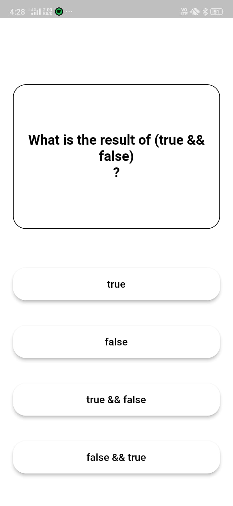
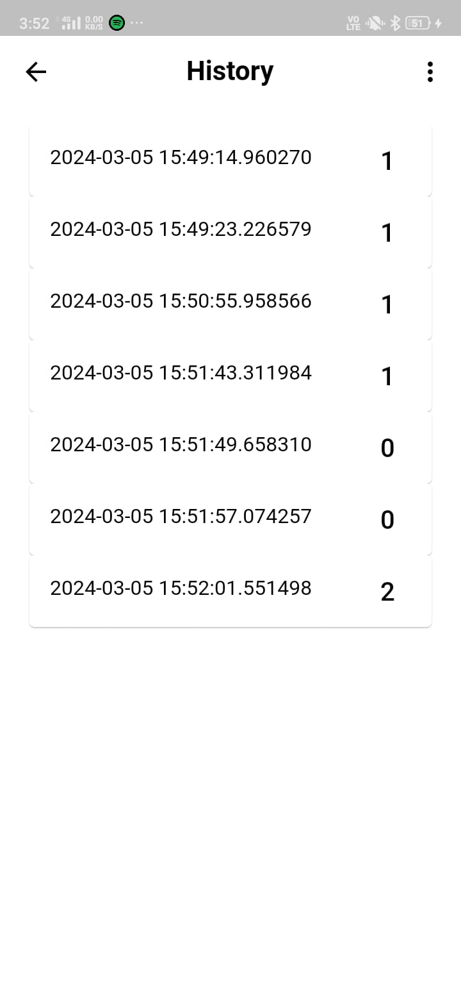

Quiz Game

Quiz Game is a Flutter application that allows users to participate in quizzes across various categories, track their scores, and view their quiz history.

Table of Contents

Features
Demo
Getting Started
Prerequisites
Installation
Usage
Contributing

Features

Dashboard with 6 quiz categories
Category-wise quiz questions
Score tracking and result display
Quiz history page

Demo

Here are some screenshots of the application:

| Home Screen                         | Question Screen                     | Result Screen                       | History Screen                      |
| ----------------------------------- | ----------------------------------- | ----------------------------------- | ----------------------------------- |
|       |  |   |  |

Getting Started

Prerequisites

Before you begin, ensure you have Flutter and Dart installed on your machine.

Installation

Clone the repository:

bash
Copy code
git clone https://github.com/yourusername/quiz-app.git
cd quiz-app
Install dependencies:

bash
Copy code
flutter pub get
Run the app:

bash
Copy code
flutter run

Usage

Launch the app on your device or emulator.
Explore quiz categories on the dashboard.
Select a category, play a quiz, and view your result.
Check your quiz history on the history page.
